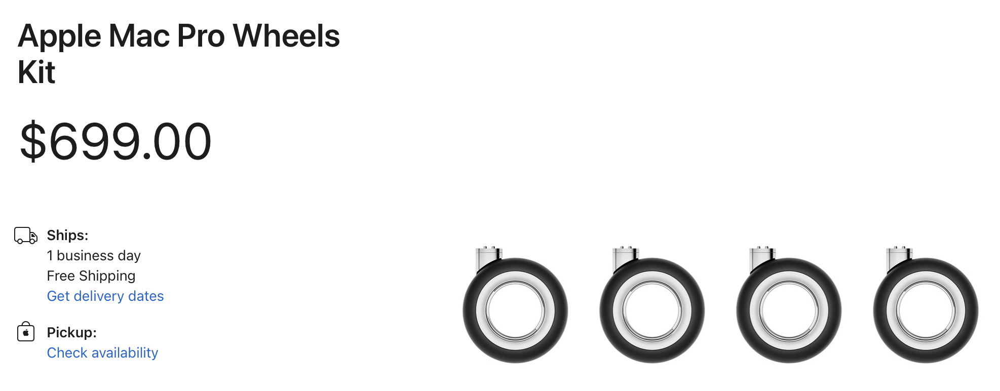

# Reactive 101: Boosting Service Throughput with 3x Less Resources*
**Terms and conditions apply.*

## Spring MVC vs Spring WebFlux

Vadim Axelrod
Senior Software Engineer at EPAM
https://axelrod.co

<style scoped>a { color: #eee; }</style>

<!-- 
Hi, everyone.
My name is Vadim Axelrod, I'm a Java developer at EPAM, and today I'm going to show you an introduction to Reactive Programming and present Spring WebFlux - the reactive-stack web framework, as well as a comparison of Spring WebFlux perfomance over a Spring MVC.

First of all, I'd like to say sorry in advance for my English.
I'm not a native speaker, so in some situations I would take my time to think, and slow down, and speak, well, basically...
-->

---


<!--
...like him.
Okay, let's move on.
-->

---


# Agenda

- Spring WebFlux
- Introduction to Reactive Programming
- Reactive Streams and Project Reactor
- JVM Threads and Linux Processes
- WebFlux and MVC - Thread models
- WebFlux and MVC - Perfomance test

<!--
We will start with quick introduction of Spring WebFlux, followed by an overview of Reactive Programming as a paradigm and Project Reactor as its implementation in Java, then we'll scratch a surface of JVM Threads in Linux, take a good look at WebFlux and MVC thread models and finish with a demo application using both of them to proove today's point. 
-->

---


# Today's point

## Spring WebFlux is better than Spring MVC


<!--
What point?
My point for today is pretty simple. Spring WebFlux is better than Spring MVC.

Why, you may ask?
But, aside from jokes, WebFlux is better because of perfomance.
-->

---


# Spring WebFlux

WebFlux is a Spring reactive-stack web framework.

<!--
Okay, what is Spring WebFlux.

I believe, everyone, who uses Java, have used Spring MVC at least once.

The original web framework included in the Spring Framework, Spring Web MVC, was purpose-built for the Servlet API and Servlet containers. The reactive-stack web framework, Spring WebFlux, was added later in version 5.0. It is fully non-blocking, supports Reactive Streams back pressure, and runs on such servers as Netty, Undertow, and Servlet 3.1+ containers.
-->

---


# Reactive Programming

## Definition

Reactive programming is a declarative programming paradigm concerned with data streams and the propagation of change.

<!--
Just to recap, WebFlux is based on Reactive Programming paradigm.
Let's start with the definition of Reactive Programming.


The output of each command in the pipeline is connected via a pipe to the input of the next command. That is, each command reads the previous command’s output. This connection is performed before any redirections specified by command1.
-->

---


# Resources matters

Non-blocking is better than blocking.


<!--
Why do we need this after all?

Because resources matters.
Your application should not consume more, than you actually need, and Spring MVC paradighm can easily led you to do so.
Resource consumption is the main advantage of Reactive Programming in general, and the main advantage of WebFlux over MVC in particular.

Just to be clear. Reactive Programming does not "lighter", it does not use less resources that classic paradigm in total. Reactive Programming provides you ability to use the already allocated resources more efficient.
Basically it means, that you haven't got a threads in your application which does nothing.
-->

---


<!-- _color: white -->

# Blocking Can Be Wasteful

Two ways to improve a program’s performance:
- parallelize to use more threads and more hardware resources.
- seek more efficiency in how current resources are used.

Reactive Programming aims to the second option by reducing wasting of resources.

<!--
Modern applications can reach huge numbers of concurrent users, and, even though the capabilities of modern hardware have continued to improve, performance of modern software is still a key concern.
There are, broadly, two ways one can improve a program’s performance:
parallelize to use more threads and more hardware resources.
seek more efficiency in how current resources are used.
Usually, Java developers write programs by using blocking code. This practice is fine until there is a performance bottleneck. Then it is time to introduce additional threads, running similar blocking code. But this scaling in resource utilization can quickly introduce contention and concurrency problems.
Worse still, blocking wastes resources. If you look closely, as soon as a program involves some latency (notably I/O, such as a database request or a network call), resources are wasted because threads (possibly many threads) now sit idle, waiting for data.
So the parallelization approach is not a silver bullet. It is necessary to access the full power of the hardware, but it is also complex to reason about and susceptible to resource wasting.
-->

---


# Reactive Programming

- [The Reactive Manifesto](https://www.reactivemanifesto.org)
- [The Reactive Principles](https://www.reactiveprinciples.org)

Reactive Systems are:
- Responsive: The system responds in a timely manner if at all possible.
- Resilient: The system stays responsive in the face of failure.
- Elastic: The system stays responsive under varying workload.
- Message Driven: Reactive Systems rely on asynchronous message-passing to establish a boundary between components that ensures loose coupling, isolation and location transparency.

<!--
As well as Agile Manifesto, for example, there is a Reactive Manifesto which stands for quality attributes, that proper reactive system should have.

So, Reactive System should be responsive, resilient, elastic and message-driven.
You can check out this manifesto as well as The Reactive Principles on the websites above.
-->

---


---


# Reactive Streams and Project Reactor

1. [Reactive Streams](http://www.reactive-streams.org) is an initiative to provide a standard for asynchronous stream processing with non-blocking back pressure.
2. The interfaces, which are 1:1 semantically equivalent to Reactive Streams, are available in [JDK9 java.util.concurrent.Flow](https://docs.oracle.com/javase/9/docs/api/java/util/concurrent/Flow.html).
3. [Project Reactor](https://projectreactor.io/docs/core/release/reference/) is an implementation of the Reactive Programming paradigm.

<!--
Well, here comes the boring part.
Reactive Programming is presented in Java by Reactive Streams as interfaces and Project Reactor as implementation.
-->

---


# java.util.concurrent.Flow

- **Publisher**
  - A producer of items (and related control messages) received by **Subscribers**.
- **Subscriber**
  - A receiver of messages.  The methods in this interface are invoked in strict sequential order for each **Subscription**.
- **Subscription**
  - Message control linking a **Publisher** and **Subscriber**.
- **Processor**
  - A component that acts as both a **Subscriber** and **Publisher**.

<!--
Let's take a closer look on them.
Just four of them.
-->

---


<!--
Reactive Programming - signals.

The interaction between the publisher and the subscriber is being controlled by so-called "signals", it is a simple calling of the methods.

-->

---


# java.util.concurrent.Flow

```java
@FunctionalInterface
public static interface Publisher<T> {
    public void subscribe(Subscriber<? super T> subscriber);
}
```

```java
public static interface Subscription {
    public void request(long n);
    public void cancel();
    }
```

```java
public static interface Subscriber<T> {
    public void onSubscribe(Subscription subscription);
    public void onNext(T item);
    public void onError(Throwable throwable);
    public void onComplete();
    }
```

<!--
Reactive Programming - signals.

The interaction between the publisher and the subscriber is being controlled by so-called "signals", it is a simple calling of the methods.

-->


---


# Project Reactor
## Producers

**Mono** and **Flux** implements Publisher interface.

### Mono
```java
Mono<String> getMessage() {
  return Mono.just("One value");
}
```

### Flux
```java
Flux<String> getMessages() {
  return Flux.just("First", "Second");
}
```

<!--
How to use them in your application?
Just like this. 
If your method should return a single response - use Mono, otherwise - use Flux.
-->

---


# Project Reactor
## Running Mono and Flux
```java
System.out.println(getMessage().block());
getMessages().subscribe(System.out::println);
```

### out
```java
One value
First
Second

Process finished with exit code 0
```

<!--
How to use them.
The main idea is, that nothing happens until you call subscribe().
No framework would somehow find and run your Mono's and Flux'es for you.
You should call them by yourself, or, for example, in case of WebFlux, it would be done by web-server.
-->

---


# Project Reactor
## Testing Mono and Flux
```java
StepVerifier.create(monoHello())
    .expectNext("Hello")
    .verifyComplete();
```

<!--
How to use them.
The main idea is, that nothing happens until you call subscribe().
No framework would somehow find and run your Mono's and Flux'es for you.
You should call them by yourself, or, for example, in case of WebFlux, it would be done by web-server.
-->

---


# Project Reactor
## Map
```java
public Mono<String> monoWorld() {
    return Mono.just("Hello world")
      .map(helloWorld -> helloWorld.split(" ")[1]);
}
```

<!--
How to use them.
The main idea is, that nothing happens until you call subscribe().
No framework would somehow find and run your Mono's and Flux'es for you.
You should call them by yourself, or, for example, in case of WebFlux, it would be done by web-server.
-->


---


# Project Reactor
## Zipping
```java
static Mono<String> monoHello() {
  return Mono.just("Hello");
}

static Mono<String> monoWorld() {
  return Mono.just("world");
}

static Mono<String> monoHelloWorld() {
  return Mono.zip(monoHello(), monoWorld())
          .map(tuple -> tuple.getT1() + " " + tuple.getT2());
}
```

<!--
How to use them.
The main idea is, that nothing happens until you call subscribe().
No framework would somehow find and run your Mono's and Flux'es for you.
You should call them by yourself, or, for example, in case of WebFlux, it would be done by web-server.
-->


---


# Project Reactor
## Hot vs Cold

- A Cold sequence starts anew for each Subscriber, including at the source of data.
- A Hot sequence does not start from scratch for each Subscriber. Rather, late subscribers receive signals emitted after they subscribed.

<!--
The Rx family of reactive libraries distinguishes two broad categories of reactive sequences: hot and cold. This distinction mainly has to do with how the reactive stream reacts to subscribers:
A Cold sequence starts anew for each Subscriber, including at the source of data. For example, if the source wraps an HTTP call, a new HTTP request is made for each subscription.
A Hot sequence does not start from scratch for each Subscriber. Rather, late subscribers receive signals emitted after they subscribed. Note, however, that some hot reactive streams can cache or replay the history of emissions totally or partially. From a general perspective, a hot sequence can even emit when no subscriber is listening (an exception to the “nothing happens before you subscribe” rule).
-->

---


# Project Reactor
## Thread model

Project Reactor not enforce a concurrency model.

`subscribe()` on Mono or Flux does not mean, that it runs in a dedicated Thread.
In Reactor, the execution model is determined by the `Scheduler`.
`Scheduler` is similar to an `ExecutorService`, and can either have no execution context (run on current thread) or specific reusable Thread or Thread pool.

WebFlux, as a framework, would handle Threads for you.

---


# Project Reactor
## Schedulers

- `Schedulers.immediate()` - the same thread
- `Schedulers.single()` - a single, reusable thread
- `Schedulers.boundedElastic()` - a thread pool (10 * num(CPU_CORES))
- `Schedulers.parallel()` - a thread pool (num(CPU_CORES))

---


# Project Reactor
## Schedulers

```java
Mono<String> monoHello = Mono.just("Hello")
  .publishOn(Schedulers.boundedElastic());

System.out.println(
  monoHello.subscribeOn(Schedulers.boundedElastic()).block()
);
```

---


# Spring MVC vs Spring WebFlux
<!--
Okay, let's move to the comparison.
In order to effectively compare perfomance of these two frameworks, we should compare their basis. Tomcat versus Netty.
-->

---


---


# Spring MVC vs Spring WebFlux
## Tomcat vs Netty

<!--
Okay, let's move to the comparison.
In order to effectively compare perfomance of these two frameworks, we should compare their basis. Tomcat versus Netty.
-->


---


# Tomcat vs Netty - Thread Models

## Spring MVC -> Tomcat
Uses Servlet Engine. 
`spring-boot-starter-web` uses Tomcat as an embedded container by default.

The Servlet Container automatically creates a new Java thread for every servlet request it receives. 
When the servlet’s done running the HTTP service method for that client’s request, the thread completes (i.e. dies).

<!--
https://docs.spring.io/spring-boot/docs/1.2.3.RELEASE/reference/html/howto-embedded-servlet-containers.html
https://docs.spring.io/spring-framework/docs/3.2.x/spring-framework-reference/html/mvc.html

Tomcat uses Thread-per-request model, which means, that 

Now let’s understand thread per request model, consider a traditional spring web application with spring mvc deployed on servlet container such as Tomcat.
-->

---


# Tomcat vs Netty - Thread Models

## Spring MVC -> Tomcat


<!--

-->


---


# Threads are expensive




<!--
Going back to the main topic - WebFlux.
Why is it bad to keep using Spring MVC.
Let's focus on Thread models.

Java thread creation is expensive because there is a fair bit of work involved:

- A large block of memory has to be allocated and initialized for the thread stack.
- System calls need to be made to create / register the native thread with the host OS.
- Descriptors need to be created, initialized and added to JVM-internal data structures.
- It is also expensive in the sense that the thread ties down resources as long as it is alive; e.g. the thread stack, any objects reachable from the stack, the JVM thread descriptors, the OS native thread descriptors.

The costs of all of these things are platform specific, but they are not cheap on any Java platform I've ever come across.


[Threads are expensive.](https://www.ibm.com/docs/en/sdk-java-technology/7.1?topic=tstt-understanding-java-native-thread-details-1)
-->


---


# Java Threads
## Stack size

[1024 KB](https://www.demo2s.com/java/java-17-data-types-stack-and-heap-memory.html)

```
vadim@ubuntu:~$ java -XX:+PrintFlagsFinal -version | grep ThreadStack 
     intx ThreadStackSize                          = 1024                                   {pd product} {default}
```

I.e. any Java Thread object allocates 1 MB.

<!--
It means, that a hundred concurrent users would use a hundred threads.
-->


---


# Tomcat vs Netty - Thread Models

## Spring WebFlux -> Netty
Uses Reactive Streams API.
`spring-boot-starter-webflux` uses Netty as an embedded reactive web server.

Netty uses EventLoops. A single EventLoop is powered by one single thread. The number of EventLoops to handle the request is equal to number of cores in your machine.
New request would not require a new Thread.

---


# Tomcat vs Netty - Thread Models

## Spring WebFlux -> Netty

Netty uses two EventLoopGroups:
- One to just accept connections and create channels.
- Another one to handle channels (reading requests and writing responses, and etc).

---


# Tomcat vs Netty - Thread Models

## Spring WebFlux -> Netty


---


# Tomcat vs Netty - ThreadLocal vs Reactive Context

One of the big technical challenges - Netty do not use ThreadLocal.

Slf4J relies on TheadLocal.
Headers relies on ThreadLocal.

The usual workaround for ThreadLocal usage is to move the contextual data along your business data, in the sequence, by using (for instance) Tuple. 

This does not look good and leaks an orthogonal concern (the contextual data) into your method and Flux signatures.

<!--
One of the big technical challenges encountered when switching from an imperative programming perspective to a reactive programming mindset lies in how you deal with threading.
Contrary to what you might be used to, in reactive programming, you can use a Thread to process several asynchronous sequences that run at roughly the same time (actually, in non-blocking locksteps). The execution can also easily and often jump from one thread to another.
This arrangement is especially hard for developers that use features dependent on the threading model being more “stable,” such as ThreadLocal. As it lets you associate data with a thread, it becomes tricky to use in a reactive context. As a result, libraries that rely on ThreadLocal at least introduce new challenges when used with Reactor. At worst, they work badly or even fail. Using the MDC of Logback to store and log correlation IDs is a prime example of such a situation.
The usual workaround for ThreadLocal usage is to move the contextual data, C, along your business data, T, in the sequence, by using (for instance) Tuple2<T, C>. This does not look good and leaks an orthogonal concern (the contextual data) into your method and Flux signatures.
-->

---


# Thread Dump for MVC
Live threads: 28
Daemon threads: 24

## Tomcat
- Catalina-utility-1
- Catalina-utility-2
- container-0
- http-nio-8081-exec-[1;10]
- http-nio-8081-Poller
- http-nio-8081-Acceptor

Total: 15

<!--
- http-nio-8081-Poller - The background thread that adds sockets to the Poller, checks the poller for triggered events and hands the associated socket off to an appropriate processor as events occur.
- http-nio-8081-Acceptor - The background thread that listens for incoming TCP/IP connections and hands them off to an appropriate processor.
-->

---


# Thread Dump for WebFlux
Live threads: 16
Daemon threads: 14

## Netty
- boundedElastic-evictor-1
- reactor-http-nio-1
- server

Total: 3

---


# Load test

### Environment
- CPU: Apple M1 Pro
- Memory: 32 Gb
- OS: macOS Monterey 12.5.1
- Java: openjdk 18.0.2 2022-07-19

### Profile
- Number of threads (users): 500
- Ramp-up period (seconds): 100
- Loop count: 200000
- Total requests: 100000000

---
# Load test
## MVC
- Total requests: 100 000 000 
- Total time: 00:59:18
- Throughput: 28096 req/sec


---

# Load test
## WebFlux 
- Total requests: 100 000 000
- Total time: 00:22:21
- Throughput: 74585 req/sec (265%)


---


---


# Q&A


---


# Thank you!

Vadim Axelrod
Senior Software Engineer at EPAM
https://axelrod.co